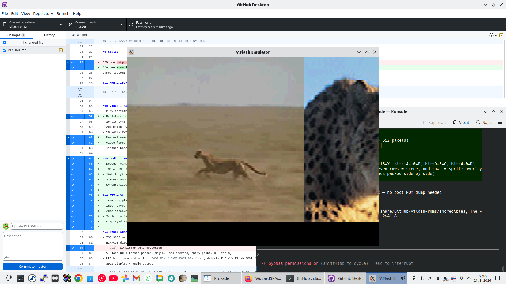

# V.Flash Emulator

First emulator for the VTech V.Flash (V.Smile Pro) educational console (2006).
No other emulator exists for this system.

## Hardware

| Component | Details |
|-----------|---------|
| CPU | LSI Logic ZEVIO 1020 SoC, ARM926EJ-S @ 150MHz |
| RAM | 16MB SDRAM |
| Media | CD-ROM, ISO 9660, no copy protection |
| Video | Motion JPEG (.mjp), raw bitmap (.ptx) |
| Audio | PCM WAV (.snd) |
| OS | µMORE v4.0 RTOS (on-disc per game, no boot ROM needed) |

## Screenshot



*The Incredibles: Mission Incredible — PTX splash screen with cutscene video + audio playback*

## Status

**Video + audio working** — all 5 available games play cutscene video with sound, scaled fullscreen.
Games tested: Cars, SpongeBob, Scooby-Doo, Disney Princess, The Incredibles.

### CPU — ARM926EJ-S (ARMv5TE)
- Full ARM32 and Thumb instruction sets
- CLZ, LDRD/STRD, DSP multiply (SMLA/SMUL/SMLAL/SMULW/QADD/QSUB)
- SWI/IRQ/FIQ/UNDEF exceptions with correct register banking
- CPI timing model; CP15 coprocessor (HIVEC, cache stubs)

### Physical memory map (ZEVIO 1020)
| Address | Size | Region |
|---------|------|--------|
| `0x00000000` | 512KB | Boot ROM (read-only NOR flash, always present) |
| `0x0FFE0000` | 128KB | Internal SRAM / TCM |
| `0x10000000` | 16MB | Main SDRAM |
| `0xFFFF0000` | 64KB | High vector mirror (ARM HIVEC) |

After MMU init, µMORE remaps virtual address 0 → SDRAM (same as TI-Nspire `INT_MMU_Initialize`).

### MMU
- ARM926EJ-S two-level page table translation
- L1 section (1MB) and coarse page table (4KB/64KB pages)
- Automatically enabled when game code sets CP15 control register

### ATAPI CD-ROM Controller
- Full PACKET command protocol at `0xAA000000` (Sony CXD3059AR compatible)
- Commands: INQUIRY, IDENTIFY PACKET DEVICE, READ(10), READ CD, READ TOC, READ CAPACITY, TEST UNIT READY, REQUEST SENSE, MODE SENSE, PREVENT/ALLOW MEDIUM REMOVAL
- Data transfer via 16-bit and 32-bit data ports
- ZEVIO IDE wrapper registers for DMA and interrupt control

### Video — MJP (Motion JPEG)
- MIAV container parser with interleaved audio/video chunks (`00dc`, `01wb`, `02wb`)
- Real-time cutscene playback: video frames decoded and displayed every emulator frame
- 16-bit byte-swap decoder (V.Flash DMA stores JPEG in swapped byte order)
- Automatic byte-stuffing restoration (hardware encoder omits JPEG FF 00 stuffing)
- SOS-only P-frame support (subsequent frames reuse I-frame's DHT/DQT tables)
- Nearest-neighbor scaling to fill 320×240 display (source: 224×112 to 352×160)
- Video loops automatically at end of file
- libjpeg-based decode with partial frame tolerance

### Audio — IMA ADPCM
- Decode `01wb` audio chunks from MIAV container
- IMA ADPCM: 4-byte header (predictor + step_index) + nibble-packed samples
- 16-bit byte-swap before decode (same as video data)
- 22050Hz mono → 44100Hz stereo upsample for SDL output
- Synchronized with video playback

### PTX — Static Images
- XBGR1555 pixel format, 44-byte header, 512px stride
- Interleaved scene/sprite layout (even rows = scene, odd rows = sprite)
- Auto-discovery via `cdrom_find_file_any` recursive disc search
- Scaled to fill 320×240 display
- Displayed as splash screen on boot (frame 0), before video starts

### Other subsystems
- ISO 9660 with full subdirectory traversal and recursive disc-wide search
- BIN/CUE disc image support (auto-detects raw 2352-byte sectors vs 2048-byte ISO)
- V.Flash BOOT format parser (magic, load address, entry point, REL table)
- HLE boot: scans disc for `BOOT.BIN`/`GAME/BOOT.BIN`/etc., detects ELF / V.Flash BOOT / raw ARM
- SDL2 display + audio output

## Build

```bash
sudo apt install libsdl2-dev libjpeg-dev
make
make testrom.bin   # build ARM32 test ROM (no cross-compiler needed)
```

## Run

```bash
./vflash game.iso                  # ISO image
./vflash game.cue                  # BIN/CUE image (auto-detected)
./vflash game.bin                  # raw BIN (auto-detected if >4MB)
./vflash --debug game.iso          # I/O trace on stderr
./vflash --dbg game.iso            # debugger, paused at boot
./vflash --dbg-run game.iso        # debugger, running
./vflash --headless game.iso       # no display
./vflash --scale 3 game.iso        # 3× window
```

## Debugger (stdin commands, F2 = pause/resume)

```
s [N]      step N instructions    c         continue
n          step over              b <addr>  set breakpoint
bc <a>|all clear BP(s)           bl        list BPs
r          registers              pc        current instruction
d <a> [N]  disassemble            m <a> [N] memory dump
mw <a> [N] word dump              bt        stack dump
setreg r0=val                     mwrite a=v
q          quit
```

## Tools

```bash
./disc_analyze  game.iso
./disc_compare  g1.iso g2.iso ...
./mjp_extract   game.iso frames/
./ptx_extract   game.iso images/
./testrom_gen                      # generates testrom.bin
```

## Test ROM

`testrom.bin` — bare ARM32 binary (716 bytes), no OS needed. Tests:
arithmetic, CLZ, MUL, timer read, input read, video DMA.

Expected output on stderr:
```
[UART] VFlash Test ROM v1.0
[UART] PASS: arithmetic
[UART] PASS: CLZ
[UART] PASS: MUL
[UART] PASS: timer
[UART] PASS: input=0x...
[UART] PASS: video DMA
[UART] ALL TESTS DONE
```

## Controls

| Key | Action |
|-----|--------|
| Arrow keys | D-Pad |
| Z/X/C/V | Red/Yellow/Green/Blue |
| Enter | OK |
| F1 | Toggle I/O trace |
| F2 | Debugger pause/resume |
| F11 | Fullscreen |
| Esc | Quit |

## BOOT.BIN format

V.Flash game discs contain a `BOOT.BIN` with a custom header:

| Offset | Size | Field |
|--------|------|-------|
| 0x00 | 4 | Magic `"BOOT"` |
| 0x04 | 4 | File size |
| 0x08 | 4 | Load address (e.g. `0x10C00000`) |
| 0x0C | 4 | Entry point offset (typically `0x10`) |
| 0x10 | 4 | `LDR PC,[PC,#-4]` trampoline |
| 0x14 | 4 | Real entry point address |
| 0x18 | 4 | `"REL\0"` relocation marker |
| 0x1C | 4 | Pointer to callback address slot (→ offset 0x20) |
| 0x20 | 4 | ROM callback address (0x1880 = PLL/reboot) |

The entire file is loaded at the specified load address. The entry point trampoline at offset 0x10 jumps to the real init code. After three init functions, BOOT.BIN calls the ROM callback at `[0x20]` which triggers a warm reboot on first run.

## Boot ROM

The emulator supports real boot ROM (`70004.bin`, 2MB) from V.Flash/V.Smile Pro hardware. Place it in the working directory or alongside game disc images.

With boot ROM present, the emulator performs a real hardware boot sequence:
1. ARM reset → PC=0, ROM executes from physical address 0
2. System control config (PLL lock, clock setup via 0x900B0000)
3. ROM copies init code to SDRAM via NOR flash controller DMA (0xB8000800+)
4. SDRAM calibration (71-entry table, patched for speed in emulation)
5. BOOT.BIN pre-loaded to RAM[0xC00000] (bypasses ATAPI during early boot)
6. UNDEF trap at ROM 0xA9D80 → recovery redirects to BOOT.BIN entry
7. BOOT.BIN init: disable IRQs → 3 init functions → enable MMU (TTB=0x10C08000) → callback
8. ROM callback at 0x1880 → warm reboot (sets 0x900A000C bit1)
9. ROM warm path → PLL init → jump to RAM[0xFFC8] (µMORE idle loop)
10. IRQ enabled → SP804 timer fires → µMORE IRQ handler at 0x100873D0
11. **First MJP frame decoded from disc and displayed**

Without boot ROM, HLE boot is used (limited — loads BOOT.BIN directly, µMORE partially functional).

### Boot memory model

The V.Flash uses the same boot model as the TI-Nspire (confirmed via [Firebird](https://github.com/nspire-emus/firebird) source):

- **Physical address 0** = 512KB boot ROM (read-only, always present)
- **Physical address 0x10000000** = 16MB SDRAM
- **Before MMU**: CPU fetches from ROM at addr 0, writes go to SDRAM
- **After MMU**: virtual addr 0 → SDRAM (writable vector table), ROM accessible only via 0xB8000000
- The NOR flash controller at 0xB8000000 provides DMA/config, **not** address remapping
- Address remapping is handled entirely by the ARM926EJ-S MMU page tables

### ZEVIO SoC — same as TI-Nspire!

The V.Flash uses the same LSI Logic ZEVIO SoC as the TI-Nspire calculator. All peripherals are standard ARM PrimeCell IP blocks, documented by the [Hackspire](https://hackspire.org/index.php/Memory-mapped_I/O_ports_on_CX) community and the [Firebird](https://github.com/nspire-emus/firebird) emulator source code.

### I/O register map

| Address | Peripheral | Type |
|---------|-----------|------|
| `0x00000000` | Boot ROM (512KB, read-only) | NOR flash |
| `0x8FFF0000` | SDRAM Controller | ARM DMC-340 |
| `0x8FFF1000` | NAND Controller | ARM PL351 |
| `0x90000000` | GPIO | |
| `0x90010000` | Fast Timer | ARM SP804 (22.5 MHz) |
| `0x90020000` | UART | ARM PL011 |
| `0x90030000` | Fastboot RAM | 4KB |
| `0x90050000` | I2C Controller | Synopsys DW |
| `0x90060000` | Watchdog Timer | ARM SP805 |
| `0x90090000` | Real-Time Clock | ARM PL031 |
| `0x900A0000` | Misc System Control | |
| `0x900B0000` | Power Management | Clocks, PLL |
| `0x900C0000` | First Timer | ARM SP804 (32 kHz) |
| `0x900D0000` | Second Timer | ARM SP804 (32 kHz) |
| `0x900E0000` | Keypad Controller | |
| `0x90110000` | LED Control | |
| `0xAA000000` | ATAPI CD-ROM | Sony CXD3059AR (emulated) |
| `0xB0000000` | USB OTG Controller | ChipIdea |
| `0xB8000000` | NOR Flash Controller | DMA to RAM |
| `0xC0000000` | LCD Controller | ARM PL111 |
| `0xC4000000` | ADC | 4 channels |
| `0xDC000000` | Interrupt Controller | ARM PL190 VIC |

### SP804 Timer registers

Standard ARM dual-timer. Two timers per block at offsets +0x00 and +0x20:

| Offset | Register | Description |
|--------|----------|-------------|
| +0x00 | Load | Count reload value |
| +0x04 | Value | Current count (decrementing) |
| +0x08 | Control | bit7=enable, bit6=periodic, bit5=IntEnable |
| +0x0C | IntClr | Write to clear interrupt |
| +0x10 | RIS | Raw interrupt status |
| +0x14 | MIS | Masked interrupt status |
| +0x18 | BGLoad | Background load value |

### PL190 VIC registers

| Offset | Register | Description |
|--------|----------|-------------|
| +0x000 | IRQStatus | Masked IRQ status |
| +0x008 | RawIntr | Raw interrupt status |
| +0x00C | IntSelect | FIQ select |
| +0x010 | IntEnable | Set interrupt enable bits |
| +0x014 | IntEnClr | Clear interrupt enable bits |

## Current status

### What works
- **Cutscene video playback** — real-time MJP decode, scaled fullscreen, looping, all 5 games
- **Cutscene audio playback** — IMA ADPCM from MIAV `01wb` chunks, synchronized with video
- **PTX splash screens** — XBGR1555 images displayed on boot, scaled fullscreen
- **ATAPI CD-ROM** — full PACKET command protocol, reads sectors from disc image
- **Boot ROM mode** — cold boot → flash DMA → SDRAM calibration → MMU → BOOT.BIN → µMORE init → warm reboot → IRQ idle
- **µMORE RTOS init** — exception vectors at RAM[0xFF80-0xFFE4], IRQ handler at 0x100873D0
- **MMU translation** — L1 section + L2 coarse page table walk, VA→PA for all accesses
- **SP804 timer** — periodic 60Hz IRQ via PL190 VIC
- **APB peripherals** — GPIO, PL011 UART, SP805 watchdog, PL031 RTC, PMU
- 6 games extracted and analyzed; all share identical load addr (0x10C00000), ROM callback (0x1880)

### What doesn't work yet
- **Game code execution** — µMORE scheduler enters idle loop, game tasks not yet loaded via ATAPI
- **LCD controller** (PL111 at `0xC0000000`) — not implemented; video uses DMA blit path
- **In-game audio** — `.snd` PCM WAV files not decoded (cutscene audio works)

## MJP / MIAV format

V.Flash games use a custom MIAV (Motion Interleaved Audio/Video) container:

### MIAV header (64 bytes)
| Offset | Size | Field |
|--------|------|-------|
| 0x00 | 4 | `"MIAV"` magic |
| 0x04 | 4 | Header size (64) |
| 0x10 | 2 | Total frame count |
| 0x14 | 2 | Frame rate (typically 30 fps) |
| 0x16 | 2 | Audio track count (1 or 2) |
| 0x18 | 2 | Video width (e.g. 224, 320, 352) |
| 0x1A | 2 | Video height (e.g. 112, 144, 160) |

### Chunks (after header)
| Field | Size | Description |
|-------|------|-------------|
| Tag | 4 | `"00dc"` (video), `"01wb"` / `"02wb"` (audio) |
| Flags | 4 | Frame index (0=I-frame for video) |
| Size | 4 | Data size in bytes |
| Data | N | Payload (byte-swapped) |

### Video key discoveries
- JPEG data is stored with **16-bit pair-swapped byte order** (ZEVIO SoC DMA artifact)
- The hardware JPEG encoder **omits byte-stuffing** (FF 00 sequences in entropy coded data)
- After pair-swap, byte-stuffing must be re-inserted before standard JPEG decoders can parse it
- First frame (I-frame) contains full JPEG headers (SOI, DQT, DHT, SOF0, SOS)
- Subsequent frames (P-frames) contain only SOS + entropy data, reusing I-frame tables

### Audio format
- **IMA ADPCM**, 16-bit byte-swapped (same as video)
- 4-byte header: predictor (int16) + step_index (uint8) + reserved (uint8)
- Followed by nibble-packed ADPCM samples (4-bit per sample)
- Sample rate: 22050 Hz mono
- ~408 bytes per chunk → ~808 samples → ~36ms per audio frame
- Interleaved: `00dc` → `01wb` → `02wb` → `00dc` → ...

### PTX image format
| Offset | Size | Field |
|--------|------|-------|
| 0x00 | 4 | Header size (typically 44) |
| 0x08 | 2 | Stride in bytes (e.g. 1024 = 512 pixels) |
| 0x0A | 2 | Height per plane (e.g. 128) |
| 0x0C | 4 | Bits per pixel (8 or 16) |
| 0x24 | 4 | Pixel data size |

- Pixel format: **XBGR1555** (16-bit: bit15=X, bits14-10=B, bits9-5=G, bits4-0=R)
- Two interleaved planes at stride 512: even rows = scene, odd rows = sprite overlay
- Texture atlas layout (multiple sub-images packed side by side)

## Notes

- Games ship with µMORE v4.0 RTOS on disc — no boot ROM dump needed
- No copy protection; games run from CD-R on real hardware
- The ZEVIO 1020 SoC memory map is estimated from code analysis — corrections welcome

## References

- [Hackspire Wiki — Memory-mapped I/O ports (Classic)](https://hackspire.org/index.php/Memory-mapped_I/O_ports_on_Classic) — ZEVIO peripheral register map
- [Hackspire Wiki — Memory-mapped I/O ports (CX)](https://hackspire.org/index.php/Memory-mapped_I/O_ports_on_CX) — CX variant registers
- [Firebird emulator](https://github.com/nspire-emus/firebird) — TI-Nspire emulator (same ZEVIO SoC), reference implementation
- [ARM926EJ-S TRM](https://ww1.microchip.com/downloads/en/DeviceDoc/ARM_926EJS_TRM.pdf) — ARM926EJ-S Technical Reference Manual
- [ARM Integrator CM926EJ-S — Using REMAP](http://infocenter.arm.com/help/topic/com.arm.doc.dui0138e/Chdiehbj.html) — Boot ROM remap mechanism
